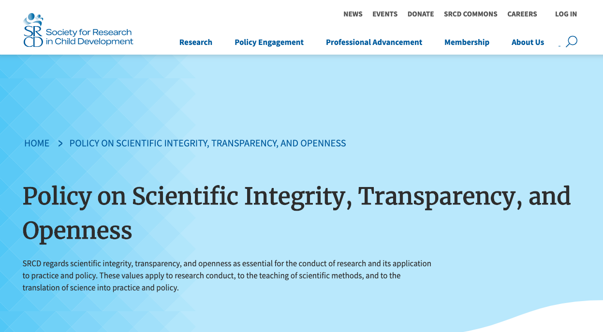

```{r setup, include=FALSE}
knitr::opts_chunk$set(echo = FALSE, fig.align = 'center')
```

# Preliminaries

## Support {.flexbox .vcenter}

<div class="centered">


</br>


</br>

</div>

---

<div class="centered">


</br>

</div>

<!-- Gilmore photo biography -->

## Agenda

- An open science manifesto 
- Databrary.org
- Make developmental neuroscience stronger

# An open science manifesto

---

```{r, echo=FALSE, fig.align='center'}
knitr::include_graphics("https://mathshistory.st-andrews.ac.uk/Biographies/Feynman/thumbnail.jpg")
```

> "*The first principle is that you must not fool yourself, and you are the easiest one to fool.*"

-- Richard P. Feynmann

## Open science accelerates discovery

- Shows your work
- Data + analysis code + tasks
- What's the effect size for manipulation X?

## Closed science *slows* discovery

- Wastes energy, time, money
- Hasn't somebody tried X before?
- How big is the 'file drawer effect'?

## Open science strengthens inference

- Improves reproducibility
- Reveals errors faster
- Permits verification, re-analysis, meta-analysis
- Boosts sample sizes & increases power

## Closed science *weakens* inference

## But will emphasizing transparency and openness in science...

> "*...yield more robust and reliable findings that others can readily build upon.*"

[[@Srcd2019-hg]](https://www.srcd.org/policy-scientific-integrity-transparency-and-openness)

## Is open sharing of research data and materials...

> "*essential for the conduct of research and its application to practice and policy.*" 

[[@Srcd2019-hg]](https://www.srcd.org/policy-scientific-integrity-transparency-and-openness)

---

```{r, fig.align='center', fig.cap='https://www.srcd.org/policy-scientific-integrity-transparency-and-openness', out.width='800px'}

```

---

> "*The advancement of detailed and diverse knowledge about the development of the world’s children is essential for improving the health and well-being of humanity.*"

[[@Srcd2019-hg]](https://www.srcd.org/policy-scientific-integrity-transparency-and-openness)

## Yes, but...

- Sharing difficult, time-consuming
- Openness not yet rewarded, highly valued
- Collecting new data better (for me) than cleaning-up finished studies to share them
- I'll change when.. the field does/I get tenure/I'm finished with my data...
- I can't share because...I don't have permission from IRB/participants/collaborators
- I own my data (don't I?)

# Databrary.org

---

<iframe src="https://nyu.databrary.org" height=600px width=1000px>
</iframe>

---

```{r}
db_stats <- databraryapi::get_db_stats()
```

- World's only data library specialized for storing and sharing video and audio + <span color="red">related data</span> from research on humans
- Hosted at New York University
- Opened 2014
- `r db_stats$institutions` institutions; `r db_stats$investigators + db_stats$affiliates` researchers; `r format(db_stats$hours, digits = 5, decimal.mark=".", big.mark=",", small.mark=".", small.interval=2)` hours of video + other data; `r db_stats$datasets_shared` shared projects

## Video and audio data pose special risks

- Faces & voices
- Names, personal locations
- Behaviors

## Video data have unique research potential

as **data**...

- Spatially & temporally dense samples of behavior
- "Outputs" of biological processes

[[@Adolph_KE_Gilmore_RO_Kennedy_JL2017-va]](https://www.apa.org/science/about/psa/2017/10/video-data)

---

and as **documentation**...

- How procedures are [actually done](https://www.play-project.org/collection.html)
- Computer-based [task displays](https://nyu.databrary.org/volume/31)

[[@Gilmore2017-wd]](https://doi.org/10.1038/s41562-017-0128)

## How Databrary protects personal data

- Data shared only with participant permission (& IRB approval)
- [Template language](https://www.databrary.org/support/irb/release-template.html), [scripts](https://www.databrary.org/support/irb/script.html) and [procedure documentation](https://www.databrary.org/video/example-video-1.mp4)

## Open sharing (but with restricted audiences)

- Researchers require institutional authorization
- [Formal access agreement](https://www.databrary.org/about/agreement.html)
- Site-wide access, not dataset-specific
- Data use and contribution

## Virtues

- Restricted data sharing has long track-record (e.g., [ICPSR](https://www.icpsr.umich.edu/))
- Meaningful [sharing permission](https://www.databrary.org/support/irb/release-levels.html); clarifies nature of risk
- Empowers participants
- Researchers & institutions determine what to share & when

---

- Open, but not public, sharing
- More secure than public data and materials services or journal web pages
- Researchers, Institutions need not reinvent wheels
- More discoverable than personal websites or institutional repositories
- Allows smaller-scale programs of research to contribute

---

- Consistent curation (and [sharing permissions](https://www.databrary.org/support/irb/release-levels.html)) makes reuse easier
- Works for data beyond video
- Secure data interaction via API

---

```{r, echo=TRUE}
databraryapi::get_db_stats()
```

[[@databraryapi]](https://play-behaviorome.github.io/databraryapi/)

## Databrary 2.0

- Updated policy framework
- Rewriting in Node.js, Hasura/GraphQL, Vue.js/Quasar

# Make developmental neuroscience stronger

## Embrace secondary re-use

- [ABCD](https://abcdstudy.org/) 
- [HBCD](https://heal.nih.gov/research/infants-and-children/healthy-brain)
- [NDA](https://nda.nih.gov/)

## Use video 

- to document and share procedures
- to capture a broader range of participants' behaviors

## Share your own data and materials

- [Databrary](https://databrary.org)
  - Data that should be restricted
  - Start with procedure videos, displays
- [Open Science Framework (OSF)](https://osf.io)
- [OpenNeuro](https://openneuro.org)

---

```{r, out.height='500px', fig.cap='https://openneuro.org/search/children'}

```

## Write and share reproducible analysis & display code

- [Psychophysics Toolbox](https://psychtoolbox.org), [Psychopy](https://psychopy.org)
- [Github](https://github.com), [Gitlab](https://gitlab.com)
- MATLAB, R, Python, shell scripts; but also SPSS, SAS, ...

## Change the scientific culture...

- Cite colleagues' data & materials
  - e.g., [[@r-lang]](https://www.R-project.org/); [[@rmarkdown-bk]](https://bookdown.org/yihui/rmarkdown); [[@rmarkdown-pkg]](rmarkdown-pkg); [[@databraryapi]](http://github.com/PLAY-behaviorome/databraryapi)
- Add open science contributions to your website, CV, etc.
- Urge professional societies and journals to adopt open science policies

## You can do it!

### Make your science open!

```{r, include=FALSE, echo=FALSE, message=FALSE}
# Change `include=FALSE` to `TRUE` to render the QR code image.
library(qrcode)
png("img/talk-qr.png")
qrcode_gen("https://gilmore-lab.github.io/2020-09-09-flux/")
dev.off()
```

---

<div class="centered">
<video width="800" loop data-autoplay>
  <source src="https://github.com/gilmore-lab/DEVSEC-2018/blob/master/mov/databrary-splash.mp4?raw=true" type="video/mp4">
  </video>
rog1\@psu.edu</br>
gilmore-lab.github.io</br></br>

</div>

# Resources

## Software

<!-- Scrolling slides -->
<!-- http://stackoverflow.com/q/38260799 -->
<style>
slides > slide { overflow: scroll; }
slides > slide:not(.nobackground):before {
  background: none;
  }
slides > slide:not(.nobackground):after {
  content: '';
  background: none;
  }
}
</style>

This talk was produced on `r Sys.Date()` in [RStudio](http://rstudio.com) using R Markdown.
The code and materials used to generate the slides may be found at <https://github.com/gilmore-lab/2020-09-02-flux>.
Information about the R Session that produced the code is as follows:
```{r session-info}
sessionInfo()
```

## References